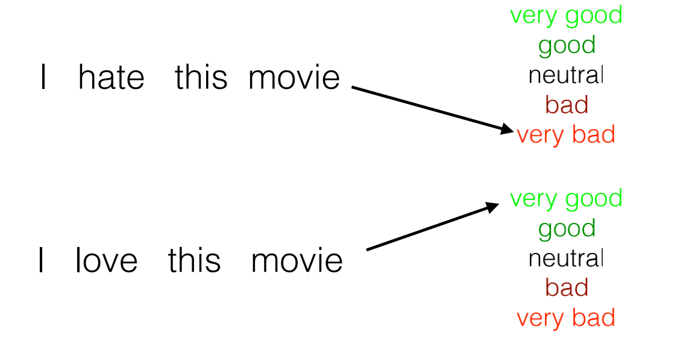

# lecture-1
#深度学习/nlp/nn4nlp

## Example

## Bag of Words(BOW)
每个词都有自己的分数，对这些分数进行处理就可以得到最后的分类结果

### 反例

### 结合特征-Combination Features
* Does it contain “don’t” and “love”?
* Does it contain “don’t”, “i”, “love”, and “nothing”?
## Basic Idea of Neural Networks(for NLP Prediction Tasks)
NLP在预测任务上的基础模型
通过神经网络用一些特殊的函数来结合抽取词的特征得到结果

## Code Example URL
https://github.com/neubig/nn4nlp-code
## CBOW
continuous bag of words
